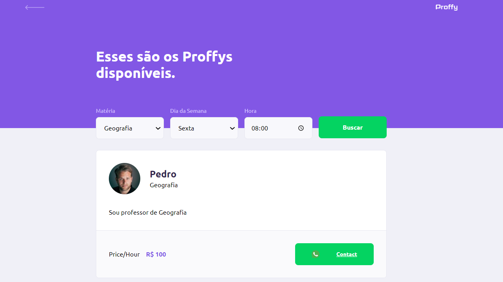
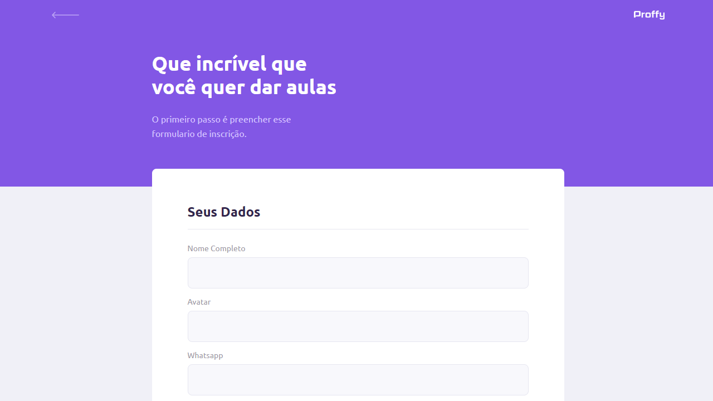

   

🚀 Projeto feito para conectar professores e estudantes. #Rocketseat NLW #2 Ago/2020

    <a href="README.md">Inglês</a>
    ·
    <a href="README-pt.md">Português</a>
 

 

  The NLW #2 project. Built with 💙 by
    <a href="https://github.com/gabrieljony">Gabriel Jony</a> and
    <a href="https://github.com/gabrieljony/Proffy/graphs/contributors">
      contributors
    </a>
  

## Sumário

- [Site Web](#web)
- [Site Mobile](#mobile)
- [Tecnologias](#stack)
- [Funcionalidades](#functions)
- [Como rodar](#run)
- [Links úteis](#link)

## 💻 Site Web

   
   
   

## 📱 Site Mobile

Aguarde...

## 📚 Tecnologias

Projeto foi feito utilizando as seguintes tecnologias:

- [Typescript](https://www.typescriptlang.org/)
- [React](https://reactjs.org/)
- [Expo](https://expo.io/)
- [Express](https://expressjs.com/)

## 💙 Funcionalidades (casos do uso)

### Conexões

- Rota para listar o total de conexões realizadas;
- Rota para criar uma nova conexão;

### Aulas

- Rota de crialção de uma aula;
- Rota para listar aulas;
  --Filtrar por matéria, dia da semana e horário

## 🏃‍♂️ Como rodar

### Create project web

`yarn create react-app web --template typescript`

### Create project backend with [KnexJs](http://knexjs.org/)

`npm install knex --save`
`npm install sqlite3`

### Create project mobile with [Expo](https://docs.expo.io/)

`npm install --global expo-cli`

Criar um novo projeto, selecionar o template typescript
`expo init frontend-mobile`

### Start project

`yarn start`

[http://localhost:3000](http://localhost:3000)

`yarn test`

`yarn build`

`yarn eject`

## 🔗 Links úteis

[Create React App documentation](https://facebook.github.io/create-react-app/docs/getting-started) 
[React documentation](https://reactjs.org/) 
[React Navigation](https://reactnavigation.org/docs/getting-started) 
[TypeScript](https://www.typescriptlang.org/) 
[Expo](https://docs.expo.io/) 
[Expo Google Fonts is released](https://dev.to/expo/expo-google-fonts-is-released-4g58) 
[Axios](https://github.com/axios/axios) 
[KnexJs](http://knexjs.org/) 
[React Select](https://react-select.com/home) 
[Whatsapp Chats](https://faq.whatsapp.com/general/chats/how-to-use-click-to-chat/) 
[API de Fotos](hhttps://randomuser.me/photos)
